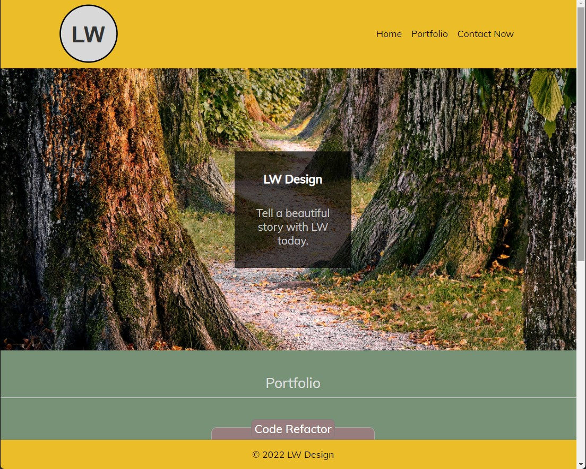

# Landing Page

## Description

This project was introduced in bootcamp as a demonstration of display and positioning, as well as the Box Model. I wrote this app to illustrate the importance of the box model as well as provide a popup modal for people to leave their name and email to contact me.

## Table of Contents (Optional)

-  [Installation](#installation)
-  [Usage](#usage)
-  [Credits](#credits)
-  [License](#license)

## Installation

No installation is required. The application works on Google Chrome browsers.

## Usage

To access the app, click on [Landing Page](https://leoelicos.github.io/bcs-01-landing-page/) on GitHub Pages.

Screenshot:

Landing Page

Popup Modal

## Credits

Chrome Developer Tools

## License

&copy; Leo Wong <leoelicos@gmail.com>

Licensed under the [MIT License](./LICENSE.txt).

---
